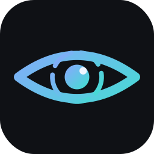

<div align="center">



# Argus

### Bridge the gap.

<sub>by **CyTwist**</sub>

**See what's actually happening on your machine.**

A local, zero-cloud detection engine for Windows. It turns raw Sysmon telemetry
into a clear, visual story of what a threat did — which process spawned what,
what it dropped, and where it called home. One binary. No account. Nothing
leaves your PC.

[](https://github.com/moshefurman/argus/releases/latest)
[](#requirements)
[](LICENSE)

</div>

---

## Install (one line)

From an **Administrator PowerShell**:

```powershell
irm https://raw.githubusercontent.com/moshefurman/argus/main/install.ps1 | iex
```

That downloads Argus, sets up the Sysmon config it needs, installs the background
service, and opens the dashboard. Then browse to **http://127.0.0.1:8080**.

Prefer to do it by hand? Grab the latest `argus-windows-amd64.zip` from
[Releases](https://github.com/moshefurman/argus/releases/latest), unzip, and run
`install.ps1`.

## What you get

- 🌳 **Process-tree detections.** Click a detection and see the real spawn
  hierarchy — the malicious chain highlighted, network / injected-PowerShell /
  C2-beacon nodes flagged in red. This is the moment you *understand* what happened.
- 🧠 **Behavioral, top-down.** Catches dropper chains, C2 beacons (Office →
  PowerShell → callout), credential theft (lsass access, reflective dumpers,
  Kerberoasting) and brute-force / password-spray — by the *story*, not by
  signatures you have to keep updating.
- 🛡️ **Defender fusion.** Combines Microsoft Defender's verdict ("what") with
  Argus's behavioral context ("how and from where") into one case.
- 🔔 **Live desktop alerts.** A clickable Windows toast the instant something
  fires — opens straight to the detection.
- 🖥️ **Local dashboard.** A dark, self-contained web UI on `127.0.0.1`, with an
  in-browser rules editor (edit, validate, hot-reload — no restart).
- 🔒 **100% local.** No cloud, no telemetry, no sign-up. Your event data never
  leaves the machine.
- ⚡ **Single binary.** One `argus.exe` — no runtime, no dependencies.

## How it works

```
Sysmon events  ->  correlation index  ->  process trees  ->  detection engine  ->  your dashboard
(live, on-box)     (create/run/comms)     (who spawned      (behavioral
                                            whom)             patterns)
```

Argus only **reads** Windows event logs (Sysmon, Microsoft Defender, and the
Security log). It never touches the kernel and installs no driver of its own.

## Requirements

- **Windows 10 or 11** (64-bit).
- **Sysmon** — the installer sets it up with a tuned config. Sysmon is a free
  Microsoft/Sysinternals tool; Argus does not redistribute it.
- **Administrator** — needed to run as a service and to read the Security log for
  authentication-based detections.

## Using it

```powershell
# Live detection in the background + dashboard (default after install)
argus serve --live

# Just browse existing detections
argus serve --db data\argus.db

# Manage the background service
argus service start | stop | uninstall
```

Change the port with `--addr 127.0.0.1:9000`. Keep Argus bound to `127.0.0.1`
(the default) — the dashboard has no authentication and is meant for the local
machine only.

## Privacy

Argus is built for people who don't trust cloud security tools with their data.
Everything — collection, correlation, storage, and the dashboard — runs on your
machine. There is no account, no telemetry, and no outbound connection made by
Argus itself.

## FAQ

**Is this open source?** No. Argus is **free for personal use** but the source is
closed — see the [LICENSE](LICENSE). You get the tool, not the code.

**Does it phone home?** No. It makes no outbound connections of its own.

**Does it replace my antivirus?** No — it *complements* Defender by adding the
behavioral story around what Defender (or Sysmon) sees.

**Why does it need admin?** To install the background service and to read the
Security log (logon / Kerberos events) for auth-attack detection. Without
elevation you still get the full Sysmon-based malware detection.

## Community

- 💬 **[Discussions](https://github.com/moshefurman/argus/discussions)** — questions,
  tips, show-and-tell, detection ideas.
- 🐛 **[Issues](https://github.com/moshefurman/argus/issues)** — bugs and feature
  requests.

## License

Argus is a **CyTwist** product. Free for personal, non-commercial use under the
**Argus End-User License Agreement** ([LICENSE](LICENSE)) — © CyTwist Ltd. Not
open source. Commercial and multi-host licensing is reserved; contact CyTwist.
